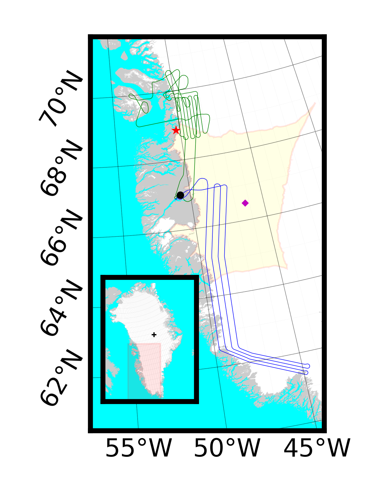
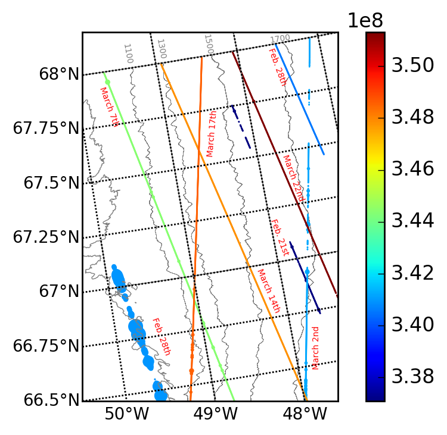
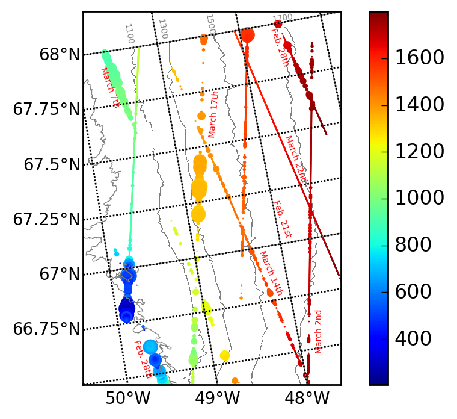
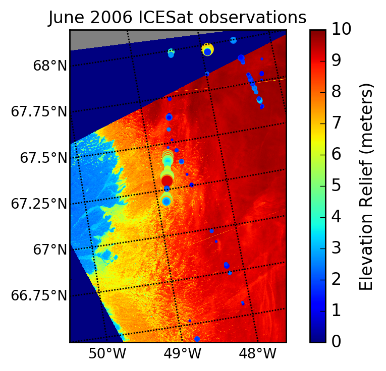

GeoFrame
========

This README provides an overview of the 'GeoFrame' object, a geospatial dataframe analogous to a pandas dataframe, designed primarily for use with satellite data. Just as a pandas dataframe is made up of `series`, a GeoFrame is a collection `aquisitions` which are often themselves composed of `granuals`. Additionally, there are four (sub)-modules that describe operations with the GeoFrame object:

 - GeoFrame Module 
 - Mapping sub-module
 - Plotting sub-module
 - Fetch sub-module
 - Transform sub-module

The top-level `GeoFrame` module targets how `GeoFrame` objects interact with each other (i.e., sub-setting, super-setting, etc).

The Mapping sub-Module describes methods for translating between coordinate systems and data views-- i.e., mapping from columns/rows to lat/lon, or mapping between various coordinate systems of `aquisitions` within a GeoFrame. 

The Plotting sub-Module describes methods for displaying data, which is controlled from the `GeoFrame` object. Since data extent is controlled by the `region` definition of the `GeoFrame` (as are default projection and resolution), plotting defaults are inherited from the top level object.

The Fetch sub-Module describes methods for constructing GeoFrames. It is intended to automate data retrieval (hence the name `fetch`), but is also meant to be source agnostic so it could be used on local files or a directory. Data discovery (query) and ingest (data readers) are contained in this module.

The transform sub-module is meant to encompass data transformation. At present, this module has overlap with the Mapping sub-module and division of tasks between them is still unclear.

GeoFrame Module
===============

The `GeoFrame` is the top level object. It's design is follows from observation of how Earth Science analysis is conducted: at the beginning of each project or analysis, a study area, study domain, or region of interest is defined. This analysis unit could be a water shed or drainage basin, a geographic or political boundary, a bounding box in some projection space, or the intersection of some set of data sources (either inclusive or exclusive). In terms of defining the `region` object, the input could by a polygon, bounding box, or grid definition. The design philosophy of the `GeoFrame` is that these analysis units can be both sub and super set to create objects of the same type. Greenland drainage basins are a good example; analysis may take place at the basin level, and then be aggregated as the full region for plotting the result. Alternatively, a basin region may be subset to a bounding box. This latter case is the preferred way to 'zoom in' when producing plots-- a subset of a `GeoFrame` is also a `GeoFrame` with a different region definition that sets the plotting defaults.

*Example of a GeoFrame region definition (yellow) with two acquisitions (green and blue). Note that acquisitions extend beyond the region; the GeoFrame object would mask the data outside of the region. Subsetting the GeoFrame south of the green acquisition would result in the new GeoFrame not including that data at all*

Acquisitions (Scenes)
---------------------

The fundamental building block of a pandas dataframe is the `series` object; all pandas dataframes are a collection of `series`. Similarly, all `GeoFrame` objects are a collection of `acquisitions`. The `aquisition` objects could also be referred to as 'scenes' (which is shorter) or 'collections'; however, 'scenes' are generally thought of as analogous to data 'granules', and 'collection' gets quickly overloaded as both a noun and an adjective, so 'acquisition' is used to be unambiguous. That said, `aquisitions` are best understood by analogy to data 'granules'. 

A data 'granule' is the distribution unit of a satellite product. For MODIS/VIIRS it is a 5 or 6 minute 'chunk' of data; for ICESat (both the original and the follow on mission), a granule is defined as either a fixed number of observations, or a fixed acquisition time. For Landsat, a granule is a fixed size data array, always pinned to a repeat track pattern.

*Example of 8 ICESat acquisitions. Each acquisition could be part of a single ICESat source file granule, or several that have been merged. Note: February 28th is two separate acquisitions because there is temporal gap between the data in the East and West of the GeoFrame.*

These data granule chunks are, for modern satellites, completely arbitrary. The sensors themselves simply acquire data continuously, and the stream is divided as a convenience for processing and distribution. A study area (region), may contain only part of a data granule, or may span over several granules, depending on the region size and the sensor. An `acquisition` is just a contiguous subset or superset of data granules, merged or subset appropriately. 'Contiguous' here means contiguous in time, which also implies contiguous in space along the orbital path. Thus, a `GeoFrame` is a collection of `aquisitions` which are time-indexed. When working with GeoFrames to derive new attributes (interpolation, merging, etc), new data layers are effectively 'synthetic' acquisitions. 

*Example of a merged data layer, now as a single 'synthetic' acquisition (Spring Elevations).*

The acquisition definition and ordering enforcement is primarily done to facilitate data fusion and masking. Let's same that you have some ICESat (or ICESat-2) tracks that you are working with, and you want to bring in additional data for filtering or fusion. The ICESat tracks may have been collected over several weeks in order to fully cover you region and study area; let's say that you'd like to pull in thermal or cloud data coincident with that data. To do this, you'll be getting MODIS data that is either closest in time, or data that brackets the ICESat observations in time both before and after the data collection. Calling `fetch` for cloud data on the full GeoFrame of ICESat data would then run the fetch per acquisition of ICESat data within the `GeoFrame` object. Doing the same call for thermal data from NCEP weather modules would do the same-- fetch the NCEP data per day/time of each overpass acquisition within the container object.

Acquisition objects have some parameters and constraints. The data within each `aquisition` is expected to be relatively contiguous and homogeneous. This means that the base spacial reference frame is consistent for all of the data in the acquisition-- i.e., the projection parameters. While the resolution may not be strictly speaking fixed (swath data pixel sizes deform off nadir of the scan), the resolution is definition is expected to be uniform for all data within the data layer. One consequence of this is that each acquisition is from one sensor, or in some cases, *one sensor subsystem*. A good example of this is MODIS, which has 250m, 500m, and 1km channels; while multiple 1km bands from the same overpass can exist as separate attributes within a single acquisition layer, data from the 500m channel would be considered a separate acquisition, and live as a separate layer within the object. (Note that the layers could be combined together as new synthetic layer-- after resampling to a common spatial output definition).

Besides uniformity in spatial reference, data `acquisition` objects are expected to contain housekeeping data that allows for integrated error propagation and provenance tracking. Attributes within the layer should have units, and either uncertainty per observation or observation method. Granule information (i.e., which data products, which granule ids) are also abstracted into this object class.

The `aquisition` objects are broadly speaking a subclass of the xarray object. They share the `region` of the `GeoFrame` that they are associated with; however, they can also have several 'masks' that modify there behavior and representation in the larger object collection. As mentioned, these arrays are time indexed; properly speaking, they have two time attributes, an acquisition time range, and a canonical midpoint index. The time range is the actual observation range of the first vs last observation; however, time ranges may overlap for multiple sensors (or a single sensor with multiple products at different resolutions), so a single integer timestamp is additionally used for actually ordering data within the `GeoFrame` object data stack.

GeoFrame Objects
----------------

The primary purpose of the `GeoFrame` object is to provide an interface for interacting with a collection data in a uniform way. While individual members (`aquisitions`) of the `GeoFrame` are expected to be homogeneous, the data collection within a `GeoFrame` can be of different resolutions, different sensors, and even different data types (i.e., raster grids and columnar data). GeoFrames are expected to mixed in matched, with the simple cases occurring automatically-- separate drainage basins of exclusive non-overlapping data can be concatenated together, and subsetting to a smaller postage stamp is a simple 'slice' that returns the smaller `GeoFrame` subset object. (More complicated merges with partial overlaps need additional information.) Most of the object state can be modified without creating a new object-- this includes the default resolution, resampling and interpolation method, display projection, etc. The exception to this is the object region; changing the object region produces a new object.

Creating a `GeoFrame` is analogous to creating a pandas dataframe; either an empty frame can be create and data added to it, or a collection of data can be used to instantiate the object. Creating an empty `GeoFrame` would be done by specifying a region.

Region
------

Region definitions, and all base spatial transformations, are in lat/lon space interpretable internally. Regions can of course be specified in any coordinate system, but the region must be able to be mapped to lat/lon. Each region is expected to contiguous; multiple polygons would be assigned a minimum bounding polygon, and then the `acquisition` layer would be globally masked to the individual polygons. Each region has a center point, and bounding information as either bounding grid coordinates, a polygon definition, and/or a bounding radius from the center point.

Fetch
=====

See example notebook.

